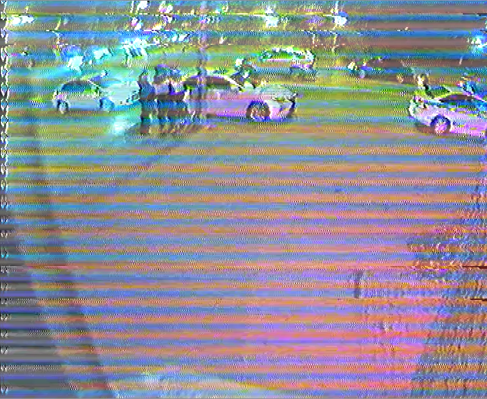

Попытка исправить картинку

Получилось как-то так:

Конвертим кортинку:
`ffmpeg -i 1.png -f rawvideo -pix_fmt rgb24 frame.raw`

Компиляем-запускаем:
`gcc 1.c&&./a.out`

Конвертим результат в кортинку:
`ffmpeg -f rawvideo -pix_fmt rgb24 -s 704x576 -i frame2.raw -y 3.png`

В принципе, можно добавить пару строк и конвертить видео, но мне лень

В принципе, я могу исправить и цветовые полосы, но мне тоже лень
